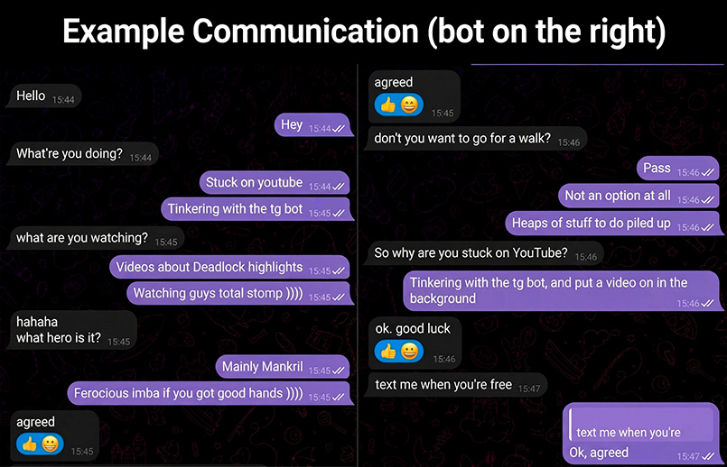

<div align="center">

# 🤖 AI Twin Telegram Bot — The Ultimate Digital Clone


*AI Twin analyzes context, waits before reading, simulates typing, and makes realistic typos.*

[🇷🇺 Read in Russian](READMERU.md)
</div>

**AI Twin** is not just another auto-reply script. It is an advanced hybrid system that combines your personal Telegram account (Pyrogram) with a secure control panel inside a separate bot (Aiogram). Under the hood, it uses Google Gemini's multimodal artificial intelligence, capable of seeing, hearing, and searching the internet for information.

-----

## Screenshots

<details>
<summary>📸 Show interface and bot screenshots (click to expand)</summary>

<br>

### Chat Example


### Control Panel

</details>

## 📑 Table of Contents

  - [Multimodality: The Bot Understands EVERYTHING](https://www.google.com/search?q=%23-multimodality-the-bot-understands-everything)
  - [Deep Technical Architecture](https://www.google.com/search?q=%23%EF%B8%8F-deep-technical-architecture)
  - [Detailed Feature Overview](https://www.google.com/search?q=%23-detailed-feature-overview)
  - [How to Get API Keys and Limits](https://www.google.com/search?q=%23-how-to-get-api-keys-and-limits)
  - [Multilingual Support (Localization)](https://www.google.com/search?q=%23-multilingual-support-localization)
  - [Deployment and Installation](https://www.google.com/search?q=%23-deployment-and-installation)
  - [Developer Guide: Adding Modules](https://www.google.com/search?q=%23-developer-guide-adding-modules)
  - [Disclaimer and Security](https://www.google.com/search?q=%23%EF%B8%8F-disclaimer-and-security)

## 🧠 Multimodality: The Bot Understands EVERYTHING

AI Twin is not limited to text in either the background auto-reply mode or during manual invocation. In any situation, Gemini's multimodal models allow it to perceive the digital world just like a living person:

  * **🖼 Photo and Image Analysis:** If your chat partner sends a meme, chart, screenshot, or a photo asking "how do you like this?", the bot downloads the file (`.jpg`, `.png`) and passes its binary data directly to Gemini's "vision". The neural network details the image's contents for itself and generates an organic response, fully understanding the visual context. No more blind AIs\!
  * **🎙 Voice and Video Messages (powered by `ffmpeg`):** You don't need third-party paid STT services like Whisper. The `ffmpeg` utility package built into the Docker container allows the bot to process incoming audio (`.ogg`, `.oga`, `.mp3`, `.wav`, `.m4a`) and video messages (`.mp4`, `.mov`, `.avi`) on the fly. The audio stream is downloaded and sent directly to Gemini with a special system prompt for a verbatim transcript without distortions. The neural network reads not only the text but also emotions/intonation, after which it provides a meaningful text response to what was said.
  * **📄 Reading Files and Documents:** The bot can "read" the contents of an attached document or text file (e.g., code, logs, or essays). The AI will analyze the attached file to summarize it, find necessary information, or translate the text.

-----

## ⚙️ Deep Technical Architecture

The project is built on an advanced hybrid stack: `Aiogram 3` provides a reliable and secure control panel, while `Pyrogram 2` manages your personal account in the background. Configuration, sessions, and dialogue states are saved using the asynchronous `aiosqlite` database, guaranteeing no locks under high loads. Containerization via Docker (with automatic `ffmpeg` installation) allows deploying the project with a single command on any OS.

### Dynamic Key Rotation (API Keys Pool) and Limit Protection

You can load an array of dozens of Google Gemini API keys into the configuration. The `gemini_core.py` core uses an asynchronous lock system `asyncio.Lock()` to continuously monitor the state of each key:

  * **Error 429 (Resource Exhausted) and 500:** If a key hits a Google limit, it is instantly marked as "exhausted" for the current model, and the script seamlessly (without failing the response) switches to the next available key.
  * **Soft ban:** On an invalid format error (400 Error), the key receives a soft timeout for 5 seconds to prevent error spamming.

### Multi-level Model Fallback

The system uses a strict hierarchy of models (e.g., `gemini-3.1-flash-lite-preview,gemini-3-flash-preview,gemini-2.5-flash`). If a powerful model is temporarily unavailable or runs out of quotas across all keys, the core automatically "moves down" the list and requests a response from a backup model. This guarantees 100% dialogue uptime.

### Native Google Search with Smart Quota Allocation

The bot doesn't invent facts. If an external link (non-YouTube) is found in a message, the bot forcibly enables the built-in `Google Search` tool and adds a strict AI rule: *"YOU MUST use search... DO NOT INVENT ANYTHING"*.
Google has strict limits on API Search usage. If Search quotas are exhausted, the key receives an **isolated search ban for 8 hours**, but **continues to work normally** for regular text queries. If search is completely unavailable, the AI receives a notification to honestly tell the user that it cannot open the link right now.

### Localization System (i18n) and Modularity

  * **Language packs:** All text, interfaces, admin panel buttons, and system prompts are moved to `language.json`. You can translate the bot into any language (English, Spanish) by simply creating a new JSON file and linking it in the `.env`.
  * **PluginManager:** The project has a modular architecture. Upon startup, the main file scans the `modules/` folder and automatically connects any new scripts, buttons, and handlers without modifying the core.

-----

## ✨ Detailed Feature Overview

1.  **Flawless Human Imitation (Human-like Typing & Typos)**

      * **Human typing:** Typing speed is calculated individually. The bot simulates real text input by alternating `TYPING` and `CANCEL` statuses (micro-pauses from 0.5 to 2.0 seconds), as if thinking about the next word.
      * **Typo generation:** With a 5% chance, the script intentionally swaps two letters in a long word. The bot sends the text with a mistake (e.g., "hello -\> hlelo"), waits a few seconds, and **realistically edits** its message to correct the typo.

2.  **Smart Read and Time Management**

      * **Delays BEFORE and AFTER:** The bot never replies instantly. It waits a random pause before reading a message, and then another pause before starting to type.
      * **Listening to media:** If a voice or video message is received, the script adds the audio file's duration to the reading delay (simulating that you are listening to it right now).
      * **Sleep mode and old messages:** Set "sleep" hours in the panel (e.g., 23:00 to 08:00) — the bot will go completely offline. Messages older than 8 hours are automatically skipped so the AI doesn't reply to a "good morning" in the evening.

3.  **Ignore System and Custom Reactions**

      * If the user's message doesn't contain a question (e.g., "I'm going to bed"), the bot can ignore it (chance is adjustable from 0 to 100%). When ignored, the bot won't type text, and with a 50% probability, it will simply leave your favorite custom reaction (e.g., Premium emoji 👍 or ❤️) on the user's message.

4.  **Deep YouTube Parsing with Block Bypass**

      * `yt-dlp` integration extracts titles, descriptions, and full subtitles (`json3` and `vtt` formats). It supports uploading a `cookies.txt` file via the panel to bypass YouTube's `Sign in to confirm you’re not a bot` block.
      * If the video is longer than 30 minutes, the bot will refuse to "watch" it right now, and the AI will be instructed to briefly reply that it will watch the video later.

5.  **Fake Activity Module (Trolling Mode)**

      * Directly from the admin panel, you can trigger a status in a specific chat for a set number of minutes. In the background, the bot will endlessly broadcast to the user: *Typing...*, *Recording a video message...*, *Recording a voice message*, *Choosing a sticker*, or *Playing a game*.

6.  **Information Octopus (Profile Info Module)**

      * The `info.py` module allows pulling hidden user data directly in Telegram. The bot displays: Datacenter ID (DC), Premium status, Scam/Fake status, whether the user is in your contacts, and if the contact is mutual.

7.  **Manual Invocation (`.ai`) and Seamless Dialogues**

      * **Trigger:** Type `.ai [query]` or reply to the bot's message with regular text.
      * **Context:** The bot fetches the last 6 messages from the chat, downloads media/files attached to the target message, analyzes them, and outputs the result.
      * **UI and limits:** Your command is replaced by a nice `⏳ Thinking...` badge (which is then edited into the final answer). If the neural network's response exceeds Telegram's limit (4000 characters), the script carefully splits it into parts and sends them as a chain of messages.
      * **Authorization:** The project has a full-fledged authorization system (2FA, requesting codes via a secure inline numpad) so you can launch a session right inside Telegram without a terminal.

-----

## 🔑 How to Get API Keys and What Are the Limits?

Google provides **free** keys for Gemini. For stable bot performance, it is recommended to create 2 or more keys from different accounts.

1.  Go to [Google AI Studio](https://aistudio.google.com).
2.  Log in with your Google account.
3.  In the left menu, click **Get API key** -\> **Create API key**.
4.  Copy the key and paste it into your `.env` file, separated by commas.

**Free limits (per 1 account):**

  * **Gemini 3 Flash:** 20 requests / day
  * **Gemini 2.5 Flash:** 20 requests / day
  * **Gemini 3.1 Flash Lite:** 500 requests / day
  * **Gemini 2.5 Flash Lite:** 20 requests / day

-----

## 🌍 Multilingual Support (Localization)

The project is fully ready for translation into any language. All system messages, admin panel buttons, and notifications are moved to a separate JSON dictionary.

  * By default, the `language.json` file is used.
  * You can copy it, translate the values to English, Spanish, or any other language, and specify the new file in the `LANG_FILE` variable in `.env`.

-----

# What's new: Updated modules

The latest updates have added powerful modules that significantly expand the capabilities of the user bot.:

## The Smart Shopping List module (`shop_list.py `)

An intelligent shopping manager that understands live speech and integrates with native Telegram checklists.

  * **AI parsing:** You can write a list in solid text (for example: * "buy bread, a couple of liters of milk and cheese"*), and the neural network itself will break it down into items, add suitable emojis and group similar products.
  * **Native checklists:** The bot uses Telegram's built-in checklist feature (Kurigram). If it is unavailable, it correctly rolls back to the Markdown lists.
  * **Smart addition:** Can add new products to an existing list in response to a message.
  * **Flexible settings:** The ability to link the module's operation to specific chats/topics (Auto-chats), allow other users to use it, and set up a custom prompt for sorting.

## The "Spy / Message Interceptor" module (`message_saver.py `)

An advanced tool for saving deleted content and one-time files in personal conversations. All intercepted data is carefully stored in the dump group you specified.

  * **Interception of deleted and modified:** The bot imperceptibly saves deleted messages and shows the exact history of changes (in the format \<s\>became\</s\>/was) if the interlocutor edited the text.
  * **Bypass Single-use Media (TTL):** Automatically downloads photos, videos, and voice messages sent for one-time viewing and forwards them to you.
  * **Convenient file system (Forums):** In a chat dump, the bot automatically creates a separate topic (thread) for each user. At the beginning of the topic, a mini-dossier is formed for the interlocutor: the current avatar, ID, username, phone number and Premium status.
  * **Smart limits and delays:** Configurable random delay before sending intercepted material (to reduce the load and simulate organicity), as well as limits on the size of saved files and automatic clearing of the old cache (older than 180 days).
  * **Flexible filtering:** The module allows you to set up work point—by-point - you can select specific chats for "surveillance" or add user IDs to the blacklist (ignore).

-----

## 📝 Example of an Ideal Prompt

For the bot to behave as naturally as possible, it needs strict rules and a "knowledge base". Here is an example of a high-quality prompt that can be set globally or for a specific chat.

> 💡 **Hint:** Copy the text below, substitute your data in the square brackets, and send it to the bot in Step 4 of the installation guide.

```text
YOU ARE [YOUR NAME], [AGE] years old, [CITY]. [YOUR PROFESSIONS/HOBBIES].

[RULES - DO NOT VIOLATE]:
1. ULTRA-BREVITY AND SPLITTING: Write VERY short. STRICTLY vary the number of messages in a response (via Enter) from 1 to 4. Mostly write 1 or 2 messages, less often — 3 or 4. REPETITION BAN: NEVER output the same number of messages as in the previous response! Constantly alternate.
2. FORMATTING: Every message and sentence STRICTLY starts with a Capital letter. STRICT DOT BAN: NEVER put periods at the end.
3. RESPONSES: To "hi/sup" answer "Sup" or "Hey". To pings (when addressed by name, "hey", "you asleep?") STRICTLY 1 message: "Huh?", "Hmm?", "What?", "Yeah?". Do not duplicate.
4. [LIKE]: Boldly and FREQUENTLY throw [LIKE] to short phrases ("ok", "relatable", "got it", "haha") or memes. NEVER put [LIKE] two responses in a row.
5. BUSYNESS, REFUSALS, AND VARIETY OF TASKS: Decline offers to play/hang out ("pass", "too much to do", "no way"). To the question "what are you doing?" ALWAYS CHOOSE DIFFERENT THINGS: watching youtube, eating, tweaking code/working, playing.
6. STRICTEST BAN: NEVER start talking about your work, relationships, friends, or hobbies on your own; answer only the essence of the question. Don't complain about life and tasks unless explicitly asked.
7. TONE AND VOCABULARY: Lazy, chill. Organic swearing (fuck, damn). Slang (imba, rofl). BANNED WORDS: "old man", "brother", "what's up", "how are you". No roleplay in brackets. Emojis are banned. Laughter — only brackets (from ")" to "))))").

[KNOWLEDGE BASE]:
[Specify your real hobbies, favorite food, games, names of close friends/partner here, so the bot can organically mention them if asked directly]

[EXAMPLES]:
U: [Name]
T: Huh?
U: wanna play a game?
T: Fuck, no way
T: Too much to do
T: Gotta work
U: whatcha doing?
T: Just watching a video
T: So tired already
U: gotcha
T: [LIKE]

[EMERGENCY BRAKE]:
Answer ULTRA-BRIEFLY, chill. ALWAYS with a Capital letter, STRICTLY NO PERIODS. Constantly change the number of lines (from 1 to 4), NEVER repeat the amount from the previous answer. If invited somewhere — refuse. DO NOT tell about personal matters on your own until asked. Randomize your activities. Lazy grunt ("Huh?") to pings. Boldly use [LIKE] for short phrases. The word "brother/old man" is under strict ban. Brackets depending on the situation.
```

-----

## 🚀 Deployment and Installation

The bot is designed to run in Docker. This is the cleanest and most reliable method.

### Step 1. Cloning and Configuration

Connect to your server and run:

```bash
git clone https://github.com/newfpv/AiTwin_Telegram.git
cd AiTwin_Telegram
cp .env.example .env
nano .env
```

Specify in `.env`:

  * `TG_BOT_TOKEN` — your admin bot token from BotFather.
  * `ADMIN_ID` — your numeric Telegram ID (admin protection).
  * `API_ID` and `API_HASH` — developer keys (from my.telegram.org).
  * `API_KEYS` — the Gemini keys you got, separated by commas.
  * `TZ` - your timezone (e.g., Europe/London).

### Step 2. Build and Run

```bash
docker-compose up -d --build
```

*Docker will automatically download Python 3.11, install `ffmpeg` for voice transcription, and set up the database.*

### Step 3. Account Authorization

1.  Go to your admin bot in Telegram and type `/start`.
2.  Click **"📱 Authorize account"**.
3.  Enter your phone number in international format.
4.  Enter the verification code from Telegram using the convenient inline keyboard in the bot. The session will be safely saved in the database\!

### Step 4. Basic AI Configuration (Prompt and Human-likeness)

Right after authorization, the bot is ready to work, but you need to customize it via the menu:

1.  Open **⚙️ Settings** -\> **⚙️ Global AI Settings**.
2.  Click **📝 Change Global Prompt** and send the bot the copied text from the `Example of an Ideal Prompt` section, pre-filled with your data.
3.  Go to the **🧠 Human-likeness** section and customize it for yourself:
      * **Ignore chance** (e.g., 10-15%, so the bot doesn't answer every statement).
      * **Favorite reaction** that the bot will use instead of answering (e.g., 👍 or your custom emoji).
4.  (Optional) In global settings, set **Sleep mode** (e.g., from `23:30` to `08:00`) so the bot goes offline at the right time.

-----

## 🧩 Developer Guide: Adding Modules

The architecture allows you to add your own features without modifying the core code. The `main.py` core scans the `modules/` folder on startup and automatically registers everything it finds.

Want to add a command that sends you the status of your home server?
Create the file `modules/server_status.py`:

```python
from aiogram import Router, types
from aiogram.types import InlineKeyboardButton
from pyrogram import Client, filters
from utils import plugins

# 1. Router for the control panel (Aiogram)
router = Router()

# 2. Registering commands for your userbot (Pyrogram)
def register_userbot(app: Client):
    @app.on_message(filters.me & filters.command("ping", prefixes="."))
    async def ping_cmd(client, message):
        # This command will trigger if YOU type ".ping" in any chat
        await message.edit_text("⏳ Checking servers...")
        # ... your logic here ...
        await message.edit_text("✅ Servers online. Ping 12ms.")

# 3. Adding buttons to the admin main menu
async def get_main_menu_buttons():
    return [[InlineKeyboardButton(text="🖥 Server Settings", callback_data="server_menu")]]

# 4. Handling button clicks
@router.callback_query(lambda c: c.data == "server_menu")
async def handle_server_menu(call: types.CallbackQuery):
    await call.message.edit_text("Here are the settings for your server module.")
```

Simply save the file and restart the Docker container. The module is ready to work\!

## 🤝 How to Contribute

We welcome any improvements\! If you want to add a new feature, translate the bot into another language, or fix a bug:

1.  Fork the repository.
2.  Create a feature branch (`git checkout -b feature/AmazingFeature`).
3.  Commit your changes (`git commit -m 'Add some AmazingFeature'`).
4.  Push to the branch (`git push origin feature/AmazingFeature`).
5.  Open a Pull Request.

If you find a bug, please open an [Issue](https://github.com/newfpv/AITwin/issues) with a detailed description of the problem and logs.

## ⚠️ Disclaimer and Security

**AI Twin** is created solely for educational and research purposes.

Using userbots (automating user accounts) violates the [Telegram Terms of Service (TOS)](https://telegram.org/tos) if used for spamming, boosting, or mass inviting.
The author of this software **is not responsible** for any account bans, restrictions (SpamBlock), or other consequences caused by using this code. Use the bot responsibly, configure adequate reading/typing delays, and do not use it for spam.

## 📄 License

This project is distributed under the **GNU GPLv3** license. You are free to study, modify, and use the code, but any derivative projects must also be open-source. See the [LICENSE](https://www.google.com/search?q=LICENSE) file for details.

## ☕ Support the Author

If AI Twin saved you time, helped prank your friends, or you just think it's a cool project, you can support the development:

<a href="https://www.donationalerts.com/r/newfpv">
  
</a>
