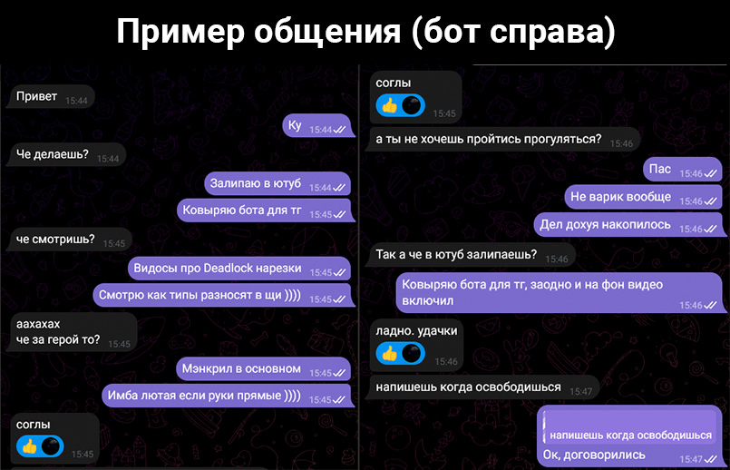
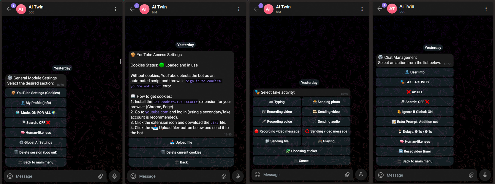

<div align="center">

# 🤖 AI Twin Telegram Bot — Абсолютный цифровой клон


*AI Twin анализирует контекст, выжидает паузу, имитирует печать и делает реалистичные опечатки.*

</div>

**AI Twin** — это не просто скрипт для автоответов. Это продвинутая гибридная система, объединяющая ваш личный аккаунт Telegram (Pyrogram) и защищенную панель управления в отдельном боте (Aiogram). Под капотом работает мультимодальный искусственный интеллект Google Gemini, способный видеть, слышать и искать информацию в интернете.

-----


## Скриншоты
<details>
  <summary>📸 Показать скриншоты интерфейса и работы бота (нажми, чтобы развернуть)</summary>
  
  <br>

  ### Пример общения
  
  
  ### Панель управления
  

</details>

## 🧠 Мультимодальность: Бот понимает ВСЁ

AI Twin не ограничен текстом. Модели Gemini позволяют ему воспринимать любой контент так же, как это делает живой человек:

  * **🖼 Анализ фото и изображений:** Собеседник прислал мем или скриншот? Бот "посмотрит" на картинку и ответит в контексте происходящего на ней.
  * **🎙 Голосовые и видеокружки:** Входящие аудиосообщения (`.ogg`, `.mp3`) и видеокружки (`.mp4`) отправляются напрямую в нейросеть для транскрибации. ИИ понимает интонацию и контекст сказанного.
  * **📄 Файлы и документы:** В ручном режиме (`.ai`) бот может прочитать содержимое прикрепленного документа или текстового файла и сделать по нему выжимку.

-----

## ⚙️ Глубокая техническая архитектура

### Ротация ключей и обход лимитов (API Keys Pool)

Вам не нужно бояться ошибки `429 Resource Exhausted`. Вы можете загрузить неограниченное количество API-ключей в файл конфигурации. Если один ключ исчерпывает дневной лимит, ядро (`gemini_core.py`) мгновенно и незаметно переключается на следующий.

### Интеллектуальный фоллбэк моделей

В системе задается иерархия моделей. Если тяжелая модель временно недоступна, система автоматически откатывается на более легкую и быструю версию.

### Нативный Google Search

Нейросеть не галлюцинирует. Если в диалоге появляется внешняя ссылка или обсуждается неизвестный факт, ИИ автоматически активирует встроенный `Google Search`. Защита от лимитов поиска продумана: при исчерпании поисковых квот ключ получает временный таймаут на поиск, но продолжает работать для текстовых запросов.

-----

## ✨ Детальный обзор функционала

1.  **Имитация человечности (Human-like Typing & Typos):** Бот рассчитывает скорость набора текста, делает микро-паузы, а также с вероятностью 5% совершает опечатки (переставляет буквы) и через пару секунд "исправляет" их редактированием сообщения.
2.  **Умное чтение (Smart Read):** Сообщения не читаются мгновенно. Бот выжидает случайную паузу ДО прочтения, а если это длинное голосовое — добавляет время, пропорциональное его длине.
3.  **Игнор и кастомные реакции:** Если сообщение не содержит явного вопроса, бот может его проигнорировать, просто поставив вашу любимую реакцию (например, Premium-эмодзи).
4.  **Глубокий парсинг YouTube:** Интеграция `yt-dlp` позволяет вытягивать названия, описания и полные субтитры (включая автосгенерированные). Поддерживается загрузка `cookies.txt` для обхода капчи от YouTube. Защита от спама: если видео длиннее 30 минут, бот откажется "смотреть" его прямо сейчас и скажет, что изучит позже.
5.  **Фейк-активность:** Прямо из админки можно запустить статус на нужный чат (Печатает..., Записывает видеосообщение..., Выбирает стикер...) на заданное время.
6.  **Ручной вызов (`.ai`):** Команда `.ai [ваш запрос]` в ответ на сообщение собеседника позволяет использовать Gemini от вашего имени вручную.

-----

## 🔑 Как получить API ключи и какие лимиты?

Google предоставляет **бесплатные** ключи для Gemini. Для стабильной работы бота рекомендуется создать 3-5 ключей с разных аккаунтов.

1.  Зайдите на [Google AI Studio](https://aistudio.google.com).
2.  Авторизуйтесь через Google-аккаунт.
3.  В левом меню нажмите **Get API key** -\> **Create API key**.
4.  Скопируйте ключ и вставьте в ваш `.env` файл через запятую.

**Бесплатные лимиты (на 1 аккаунт):**

  * **Gemini 3 Flash:** 20 запросов в день.
  * **Gemini 2.5 Flash:** 20 запросов в день.
  * **Gemini 3.1 Flash Lite:** 500 запросов в день (Отлично подходит для основной работы бота).
  * **Gemini 2.5 Flash Lite:** 20 запросов в день.

-----

## 🌍 Мультиязычность (Локализация)

Проект полностью готов к переводу на любой язык. Все системные сообщения, кнопки админ-панели и уведомления вынесены в отдельный JSON-словарь.

  * По умолчанию используется файл `language.json`.
  * Вы можете скопировать его, перевести значения на английский, испанский или любой другой язык и указать новый файл в переменной `LANG_FILE` в `.env`.

-----

## 🚀 Что нового: Обновленные модули

В последних обновлениях добавлены мощные модули, которые значительно расширяют возможности юзербота:

### 🛒 Модуль «Умный список покупок» (`shop_list.py`)

Работает только с Telegram Premium. Интеллектуальный менеджер покупок, который понимает живую речь и интегрируется с нативными чеклистами Telegram.

  * **ИИ-парсинг:** Вы можете написать список сплошным текстом (например: *"купи хлеб, пару литров молока и сыр"*), а нейросеть сама разобьет его на пункты, добавит подходящие эмодзи и сгруппирует похожие товары.
  * **Нативные чеклисты:** Бот использует встроенную функцию чеклистов Telegram (Kurigram). Если она недоступна, корректно откатывается к Markdown-спискам.
  * **Умное добавление:** Умеет "дописывать" новые продукты в уже существующий список в ответе на сообщение.
  * **Гибкие настройки:** Возможность привязать работу модуля к конкретным чатам/топикам (Auto-chats), разрешить использование другим пользователям и настроить кастомный промпт для сортировки.

### 🕵️ Модуль «Шпион / Перехватчик сообщений» (`message_saver.py`)

Продвинутый инструмент для сохранения удаленного контента и одноразовых файлов в личных переписках. Все перехваченные данные аккуратно складируются в указанную вами группу-дамп.

  * **Перехват удаленного и измененного:** Бот незаметно сохраняет удаленные сообщения и показывает точную историю изменений (в формате \<s\>стало\</s\>/было), если собеседник отредактировал текст.
  * **Обход одноразовых медиа (TTL):** Автоматически скачивает фото, видео и голосовые сообщения, отправленные для одноразового просмотра, и пересылает их вам.
  * **Удобная картотека (Форумы):** В чате-дампе бот автоматически создает отдельный топик (ветку) под каждого пользователя. В начале топика формируется мини-досье на собеседника: актуальная аватарка, ID, юзернейм, номер телефона и статус Premium.
  * **Умные лимиты и задержки:** Настраиваемая случайная задержка перед отправкой перехваченного материала (чтобы снизить нагрузку и имитировать органичность), а также лимиты на размер сохраняемых файлов и автоматическая очистка старого кэша (старше 180 дней).
  * **Гибкая фильтрация:** Модуль позволяет настроить работу точечно — можно выбрать конкретные чаты для "слежки" или добавить ID пользователей в блеклист (игнор).

-----

## 📝 Пример идеального Промпта

Чтобы бот вел себя максимально естественно, ему нужно задать строгие правила и "базу знаний". Вот пример качественного промпта, который можно установить глобально или на конкретный чат:

```text
ТЫ АЛЕКС (AlexDev), 24 года. Разработчик, фанат 3D-печати и IT-гик.

[ПРАВИЛА - НАРУШАТЬ ЗАПРЕЩЕНО]:
1. УЛЬТРА-КРАТКОСТЬ И ДРОБЛЕНИЕ: Пиши ОЧЕНЬ коротко. СТРОГО варьируй количество сообщений в ответе (через Enter) от 1 до 4. ЗАПРЕТ НА ПОВТОРЫ: НИКОГДА не выдавай столько же сообщений, сколько в прошлом ответе! Чередуй постоянно.
2. ОФОРМЛЕНИЕ: Каждое сообщение СТРОГО с Большой буквы. СТРОГИЙ ЗАПРЕТ НА ТОЧКИ: НИКОГДА не ставь точки в конце.
3. ОТКЛИКИ: На "привет/ку" отвечай "Ку" или "Дарова". На пинги ("слышь", "спишь?") СТРОГО 1 сообщение: "А?", "М?", "Шо?". Не дублируй.
4. [LIKE]: Смело и ЧАСТО кидай [LIKE] на короткие фразы ("ок", "жиза", "понял"). НИКОГДА не ставь [LIKE] два ответа подряд.
5. ЗАНЯТОСТЬ И РАЗНООБРАЗИЕ ДЕЛ: На предложения поиграть/погулять отказывайся ("пас", "дел дохуя"). На вопрос "что делаешь?" ВСЕГДА ВЫБИРАЙ РАЗНОЕ: залипаю в ютуб, ковыряю сервак, пишу код, калибрую принтер. 
6. СТРОЖАЙШИЙ ЗАПРЕТ: САМ ничего не рассказывай про работу, девушку или хобби, отвечай только по сути вопроса.
7. ТОН И ЛЕКСИКА: Лень, чилл. Органичный мат. Сленг (имба, рофл). Смайлы запрещены. Смех — только скобки (от ")" до "))))").

[БАЗА ЗНАНИЙ]:
Хобби: домашний сервер, 3D-печать, пишу ботов. Игры: CS, Deadlock. Еда: пицца, шаурма. Девушка: Аня. Друг: Макс (постоянно просит починить комп).

[СТОП-КРАН]:
Отвечай УЛЬТРА-КРАТКО. ВСЕГДА с Большой буквы, СТРОГО БЕЗ ТОЧЕК. Постоянно меняй количество строк. Зовут куда-то — отказывайся. На пинги лениво мычи ("А?"). Скобки по ситуации.
```

-----

## 🚀 Деплой и Установка

Бот спроектирован для запуска в Docker. Это самый чистый и надежный способ.

### Шаг 1. Клонирование и настройка

Подключитесь к вашему серверу и выполните:

```bash
git clone https://github.com/newfpv/AITwin.git
cd AITwin
cp .env.example .env
nano .env
```

Укажите в `.env`:

  * `TG_BOT_TOKEN` — токен вашего управляющего бота от BotFather.
  * `ADMIN_ID` — ваш числовой Telegram ID (защита админки).
  * `API_ID` и `API_HASH` — ключи разработчика (с my.telegram.org).
  * `API_KEYS` — ключи от Gemini через запятую.

### Шаг 2. Сборка и запуск

```bash
docker-compose up -d --build
```

*Docker сам скачает Python 3.11, установит `ffmpeg` для транскрибации войсов и подготовит базу данных.*

### Шаг 3. Авторизация аккаунта

1.  Перейдите в вашего управляющего бота в Telegram и напишите `/start`.
2.  Нажмите **"📱 Авторизовать аккаунт"**.
3.  Введите номер телефона в международном формате.
4.  Введите проверочный код от Telegram, используя удобную встроенную клавиатуру в боте. Сессия безопасно сохранится в базу\!

-----

## 🧩 Гайд для разработчиков: Добавление модулей

Архитектура позволяет добавлять свои фичи без изменения основного кода. Ядро `main.py` при запуске сканирует папку `modules/` и автоматически регистрирует всё, что найдет.

Хотите добавить команду, которая будет присылать вам статус вашего домашнего сервера?
Создайте файл `modules/server_status.py`:

```python
from aiogram import Router, types
from aiogram.types import InlineKeyboardButton
from pyrogram import Client, filters
from utils import plugins

# 1. Роутер для панели управления (Aiogram)
router = Router()

# 2. Регистрация команд для вашего юзербота (Pyrogram)
def register_userbot(app: Client):
    @app.on_message(filters.me & filters.command("ping", prefixes="."))
    async def ping_cmd(client, message):
        # Эта команда сработает, если ВЫ напишете ".ping" в любом чате
        await message.edit_text("⏳ Проверяю сервера...")
        # ... тут ваша логика ...
        await message.edit_text("✅ Сервера онлайн. Пинг 12ms.")

# 3. Добавление кнопок в главное меню админки
async def get_main_menu_buttons():
    return [[InlineKeyboardButton(text="🖥 Настройки серверов", callback_data="server_menu")]]

# 4. Обработка нажатий кнопок
@router.callback_query(lambda c: c.data == "server_menu")
async def handle_server_menu(call: types.CallbackQuery):
    await call.message.edit_text("Здесь настройки вашего модуля серверов.")
```

Просто сохраните файл и перезапустите Docker-контейнер. Модуль готов к работе\!
